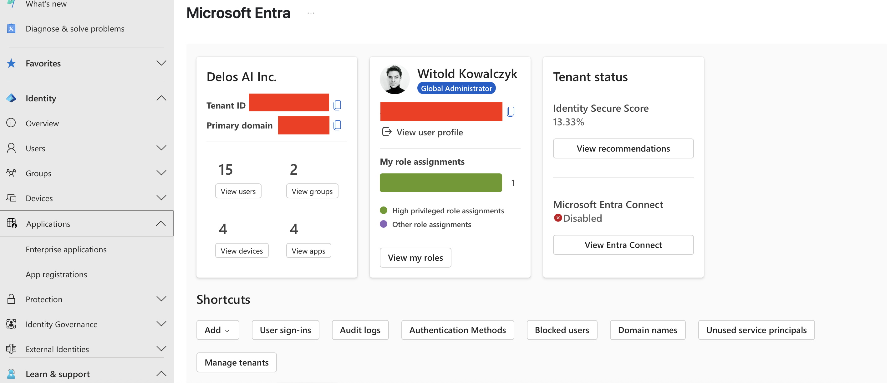
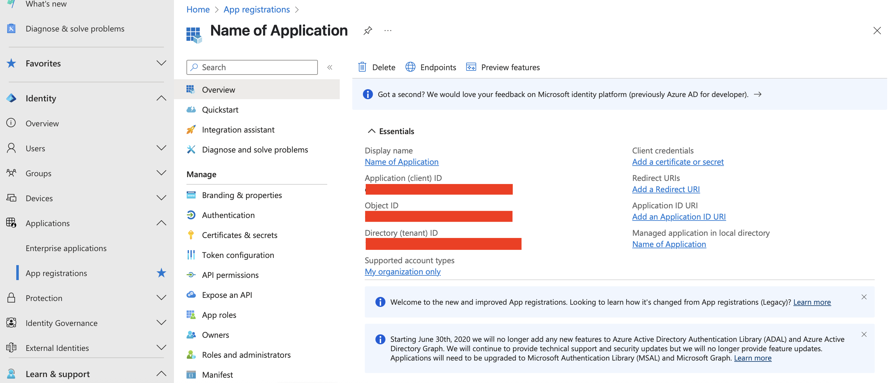
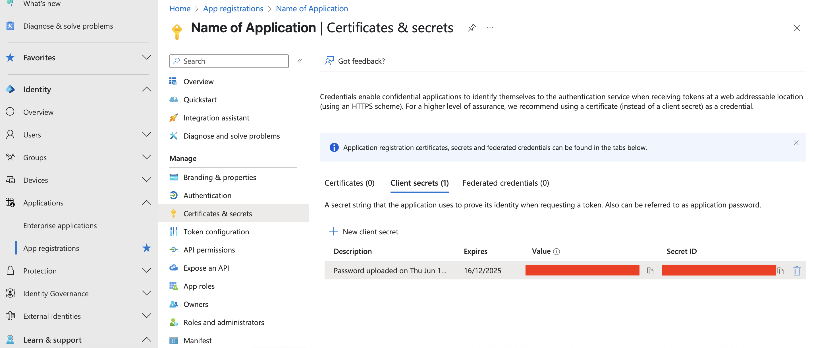
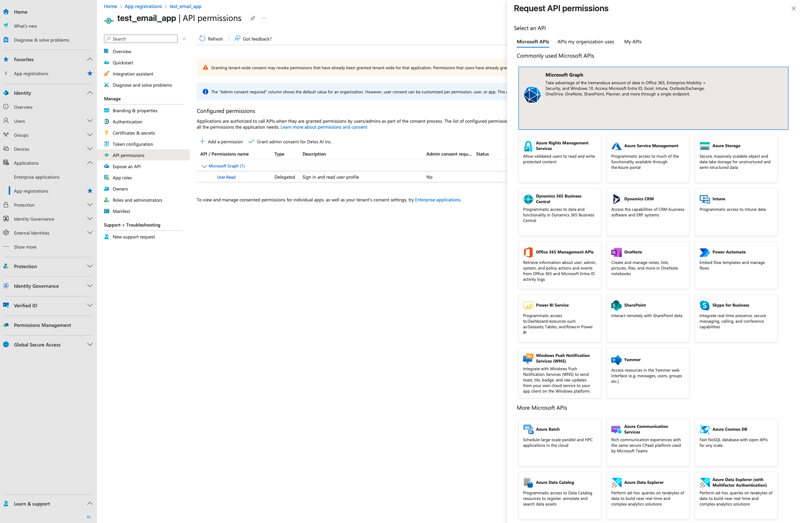
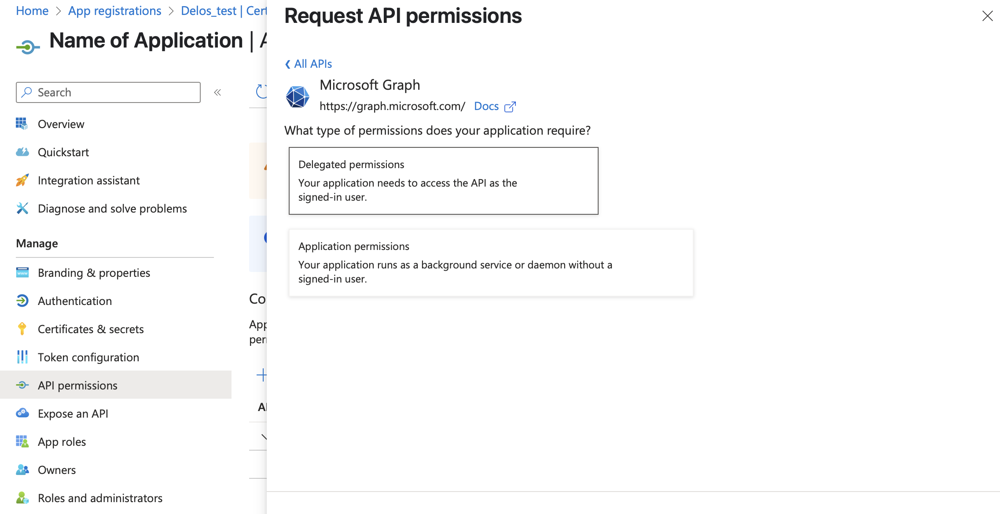

# YouGotMail - build digital co-workers in MS Outlook

## 📝 TL;DR 

### 🤖 What 
- 🤖 easy-to-use library for retrieving and sending emails with MS Outlook's API
- 🤖 AI tools to automate retrieval and sending of emails
- 📨 walkthrough + tools to build digital co-workers: spin up an AI agent running an inbox inside AWS Lambda (work in progress)

### 📦 Stack 
- 🐍 Python
- 🧠 OpenAI
- 📧 MS Outlook API
- 🗄️ MongoDB
- ☁️ AWS

### 🤔 Why 
- 📬 over 1/3rd of hours spent in every job is email-based
- 📧 buidling digital co-workers requires building digital email-users
- ✨ AI + Email = 🔥

### *Note on version and tested/untested features*
- *status: all methods listed below are (or should be) working. However I haven't had time to unit test them and write proper error handling. The docs below outline which methods have been tested and which haven't. I will be updating the version and status over the upcoming weeks*
- *current version: 0.0.14*
- *last update: 2025-07-10*

## 🚀 Quickstart 

You will first need to set-up MS email credentials for your inbox. See [Getting MS credentials and setting up your inbox](#getting-ms-credentials-and-setting-up-your-inbox) for instructions. If you have those credentials, you can run the code below.

```bash
pip install yougotmail
```

```python
from yougotmail import YouGotMail

inbox = "yougotmail@outlook.com" # the email address of the inbox on which you will be operating

ygm = YouGotMail(
    client_id="MS_CLIENT_ID",
    client_secret="MS_CLIENT_SECRET",
    tenant_id="MS_TENANT_ID"
)

emails = ygm.get_emails(
    inbox=[inbox], # list of inboxes from which you're retrieving email
    range="last_30_minutes", # the time range 
    attachments=False # whether to include attachments in the returned email or not
)

print(emails)
```

Possible time ranges are:

| Time Range | Description |
|------------|-------------|
| `previous_year` | full previous year before the current year (e.g. 2024 if current year is 2025) |
| `previous_month` | full previous month (e.g. June 2025 if current month is July 2025) |
| `previous_week` | full previous week |
| `previous_day` | full previous day |
| `last_365_days` | last 365 days until current date |
| `last_30_days` | last 30 days until current date |
| `last_7_days` | last 7 days until current date |
| `last_24_hours` | Last 24 hours until current time |
| `last_12_hours` | Last 12 hours until current time |
| `last_8_hours` | Last 8 hours until current time |
| `last_hour` | Last hour until current time |
| `last_30_minutes` | Last 30 minutes until current time |

## 📑 Table of Contents

- [📖 Introduction](#-introduction)
- [🔑 Getting MS credentials and setting up your inbox](#-getting-ms-credentials-and-setting-up-your-inbox)
  - [Step 1: Login to Microsoft Entra](#step-1-login-to-your-microsoft-entra-account-at-httpsenframicrosoftcom)
  - [Step 2: Go into Applications & Retrieve the Tenant Id](#step-2-go-into-applications--retrieve-the-tenant-id)
  - [Step 3: Under Applications, go into App registrations](#step-3-under-applications-go-into-app-registrations)
  - [Step 4: Retrieve the client_id](#step-4-retrieve-the-client_id)
  - [Step 5: Create a new secret](#step-5-create-a-new-secret)
  - [Step 6: Grant your app permissions to the email API](#step-6-grant-your-app-permissions-to-the-email-api)
  - [Step 7: Run Quickstart code](#step-7-run-quickstart-code)
- [🤖 Quickstart #2: Structured Outputs from emails with OpenAI](#quickstart-2-structured-outputs-from-emails-with-openai)
- [📤 Quickstart #3: Sending emails](#quickstart-3-sending-emails)
- [📨 Retrieving Emails](#retrieving-emails)
- [Retrieving Conversations](#retrieving-conversations)
- [Retrieving Only Attachments](#retrieving-only-attachments)
- [📤 Sending Emails](#sending-emails)
  - [Draft emails](#draft-emails)
  - [Send emails](#send-emails)
  - [Reply to emails](#reply-to-emails)
- [Move and Delete Operations](#move-and-delete-operations)
  - [Move Email to Folder](#move-email-to-folder)
  - [Delete Email](#delete-email)
  - [Delete Conversation](#delete-conversation)
- [🗄️ Storage](#storage)
  - [Note on dependencies needed for storage](#note-on-dependencies-needed-for-storage)
  - [Local deployment example](#local-deployment-example)

## Introduction

Microsoft Outlook is one of the most popular email clients among enterprises and business users.
In some roles - handling email is almost the entire job. People receive emails, extract data from them, pass that data to other systems, retrieve data from those systems and send it via email. And so it goes.

Hence, if you're building meaningful AI agents, you need to integrate with email. If you do it for the enterprise, you need to integrate with MS Outlook.

Furthermore, emails are a natural communication method that humans know and use daily.
Creating AI Agents that can live in an email environment offers a natural way of interacting with AI systems. For example an AI CC'd into a conversation could easily perform tasks that the parties of the email thread want handled.

Building integrations into MS Outlook is particularly painful. because (as all things Microsoft) the API has many rules that make it time-consuming to build anything.

This library is meant to facilitate that. At the same time it will offer 3 types of AI solutions:
- a set of AI helper functions meant to facilite the work with email retrieval and email sending (e.g. structured outputs from emails)
- an AI Agent that lives in your inbox and handles email work for you
- an AI agent that acts as a standalone inbox operatord can be used as an AI interface

The goal is to provide:
- easy way to build an AI agent working on actual emails (ie. your personal inbox)
- easily spin up Outlook native agents with a few pre-defined instructions from users: turn an email address into a logistics dispatcher, a lawyer, a contract manager, a customer support specialist or more

## Getting MS credentials and setting up your inbox

To initialize the YouGotMail class to work with your Outlook inbox we need to do 3 things:

1. Create a new "app" in Azure Entra  
2. Grant this app permissions to access the various MS email APIs (read, draft, send)
3. Retrieve 3 unique ids that will be used to authenticate access to the inbox:
    - client_id
    - client_secret 
    - tenant_id

### Step 1: Login to your Microsoft Entra account at https://entra.microsoft.com/

You can use your normal MS login. Ideally you should be the admin user in your org. If not that's ok, you will need to ask the admin to authorize the authorization.

### Step 2: Go into Applications & Retrieve the Tenant Id

Once logged in, you can go into Applications. In the main Applications Dashboard you should see the tenant id for your org. You can copy it from here and store it.



### Step 3: Under Applications, go into App registrations

Click on "New registration" to create a new app.


You can select "Accounts in this organizational directory only (Your Organization Name only - Single tenant)"


### Step 4: Retrieve the client_id

Once created, you can grab the "Application (client) ID" from the application's dashboard. This is our "client_id".

Almost there - 2 down - 1 to go!



### Step 5: Create a new secret

In the sidebar of the application (not your Entra sidebar) you have "Certificates & secrets". In there you can click on "New client secret". You can leave the Description blank.A new secret will be created - you can copy the id in the "Value" columne (NOT one in the "Secret ID" - thanks Microsoft for this create UX!). You have now your "client_secret" that we will use to instatiate the YouGotEmail class. Success!

Note: the secret will expire after 6 months. The date is shown in the Expires column. Make a note of it and set-up some calendar reminders.



### Step 6: Grant your app permissions to the email API

The final thing we need to do is grant your app permissions to the email API. From the app's sidebar click on "API permissions". Then "Add a permission". Select MS Graph.

Select "Application permissions".




Chose "Application permissions".



From the list of API permissions select all related to email. You can type "Mail" in the search bar. Including MailboxFolder, MailboxItem, Mailbox Settings, Mail, User-Mail.


Finally, each permission requires Admin access. If you're the Admin you can click on the button at the top of the permissions table. If you're not, you need to send a request to your admin. Click on "Grant admin consent for <your org name>".


### Step 7: Run Quickstart code

You can now run the Quickstart code by passing your credentials to the YouGotMail class.

## Quickstart #2: Structured Outputs from emails with OpenAI

You can pass your OpenAI API key to the YouGotMail class and call the `ai_get_emails_with_structured_output()` method to retrieve emails from MS Outlook and have OpenAI structured output from the email body. You will need to pass a schema of the info you want extracted from the email body.

The AI features rely on OpenAI. The OpenAI SDK is listed in dependencies as optional. In order to run ygm with OpenAI you will need to install it first:

```bash
pip install "yougotmail[openai]"
```

Then run the code below:

```python
from yougotmail import YouGotMail

inbox = "yougotmail@outlook.com" # the email address of the inbox on which you will be operating

ygm = YouGotMail(
            client_id="MS_CLIENT_ID",
            client_secret="MS_CLIENT_SECRET",
            tenant_id="MS_TENANT_ID",
            open_ai_api_key="OPENAI_API_KEY"
            )


emails = ygm.ai_get_emails_with_structured_output(
    inbox=[inbox],
    range="last_8_hours",
    attachments=False,
    schema={ # provide a simple JSON schema to the AI outlining what info you want to retrieve from the email
        "topic": {
            "type": "string", 
            "description": "The topic of the email"
            },
        "sentiment": {"type": "string", "description": "what was the mood of the email"}
        },
    instructions="Extract the topic and sentiment of the email" # instructions for the AI to follow
        )

print(emails)
```

## Quickstart #3: Sending emails

```python
from yougotmail import YouGotMail

inbox = "yougotmail@outlook.com" # the email address of the inbox from which you will be sending

ygm = YouGotMail(
    client_id="MS_CLIENT_ID",
    client_secret="MS_CLIENT_SECRET",
    tenant_id="MS_TENANT_ID"
)

result = ygm.send_email(
    inbox=inbox,
    subject="Meeting Follow-up",
    importance="Normal", # "Low", "Normal", or "High" or empty
    email_body="<html><body><h1>Test Email</h1><p>This is a test email sent from YouGotMail.</p></body></html>", # Structure in HTML
    to_recipients=["colleague@company.com", "manager@company.com"], # list of email addresses
    cc_recipients=["team-lead@company.com"], # list of email addresses
    bcc_recipients=[], # list of email addresses
    attachments=["https://www.google.com/images/branding/googlelogo/1x/googlelogo_color_272x92dp.png"] # list of file paths to attach
)

print(result)

# Returns:
# {
#     "status": "success",
#     "message": "Email sent successfully",
#     "recipients": {
#         "to": ["colleague@company.com", "manager@company.com"],
#         "cc": ["team-lead@company.com"],
#         "bcc": []
#     },
#     "subject": "Meeting Follow-up",
#     "body": "Hi team,..."
# }
```


## Retrieving Emails

The get_emails() method allows to retrieve emails from your inbox using multiple filters.

```python

from yougotmail import YouGotMail

inbox = "yougotmail@outlook.com" # the email address of the inbox on which you will be operating

ygm = YouGotMail(
    client_id="MS_CLIENT_ID",
    client_secret="MS_CLIENT_SECRET",
    tenant_id="MS_TENANT_ID"
)

inbox_list = ["yougotmail@outlook.com", "yougotmail2@outlook.com"] # the email address of the inbox on which you will be operating

emails = ygm.get_emails(
    inbox=inbox_list, 
    range="",
    start_date="",
    start_time="",
    end_date="",
    end_time="",
    subject=[],
    sender_name=[],
    sender_address=[],
    recipients=[],
    cc=[],
    bcc=[],
    folder_path="",
    drafts=False,
    archived=False,
    deleted=False, 
    sent=False, 
    read="all", 
    attachments=True,
    storage=None
)
```

| Parameter | Required | Type | Description/Options |
|-----------|----------|------|-------------|
| `inbox` | Yes | list | List of inboxes from which you're retrieving email, you can retrieve from multiple tenants at once |
| `range` | No | string | Time range to filter by (e.g. previous_year, previous_month, previous_week, etc.) |
| `start_date` | No | string | Start date in YYYY-MM-DD format. Note: can't use with range |
| `start_time` | No | string | Start time in 00:00:00 format (UTC) |
| `end_date` | No | string | End date in YYYY-MM-DD format |
| `end_time` | No | string | End time in 00:00:00 format (UTC) |
| `subject` | No | list | List of subject keywords to filter by |
| `sender_name` | No | list | List of sender names to filter by |
| `sender_address` | No | list | List of sender email addresses to filter by |
| `recipients` | No | list | List of recipient email addresses to filter by |
| `cc` | No | list | List of CC recipient email addresses to filter by |
| `bcc` | No | list | List of BCC recipient email addresses to filter by |
| `folder_path` | No | string | Folder path to retrieve emails from (e.g. "Documents/Invoices/Carriers") |
| `drafts` | No | boolean | If True, returns only draft emails |
| `archived` | No | string/boolean | True for archived only, False for non-archived, "all" for both |
| `deleted` | No | string/boolean | True for deleted only, False for non-deleted, "all" for both |
| `sent` | No | string/boolean | True for sent only, False for received only, "all" for both |
| `read` | No | string | "all", "read", or "unread" to filter by read status |
| `attachments` | No | boolean | If True, includes attachments in response |
| `storage` | No | string | None, "emails", or "emails_and_attachments". Requires MongoDB and AWS credentials |


This query should return a list of emails that looks like this for each inbox query:

```json
{
        "inbox": "example@example.com",
        "number_of_emails_found": 22, 
        "emails": [
            {
                "email_id": "ms_outlook_assigned_email_id_of_the_email",
                "received_date": "2025-07-08T04:23:00Z", 
                "folder_name": "Inbox", 
                "sender_name": "John Doe", 
                "sender_address": "john.doe@example.com", 
                "conversation_id": "conversation_id_of_the_email", 
                "recipients": [
                    {
                        "recipient_name": "Jane Doe",
                        "recipient_address": "jane.doe@example.com"
                    }
                ],
                "cc": [
                    {
                        "cc_recipient_name": "John Doe",
                        "cc_recipient_address": "john.doe@example.com"
                    }
                ],
                "bcc": [],
                "subject": "The subject of the email",
                "body": "The body of the email",
                "attachments": [
                    {
                        "attachment_id": "ms_outlook_assigned_attachment_id_of_the_attachment",
                        "file_name": "example_name.pdf", 
                        "date": "2025-07-08T04:23:00Z", 
                        "contentType": "application/octet-stream", 
                        "contentBytes": "JVBERi0xLj...." 
                    }
                ]
            }
        ]
    }

```

In case of multiple inboxes, the query will return a list of inboxes with the emails found in each inbox.

```json
[
    {
        "inbox": "example@example.com",
        "number_of_emails_found": 22,
        "emails": []
    },
    {
        "inbox": "example2@example.com",
        "number_of_emails_found": 10,
        "emails": []
    }
]
```

## Retrieving Conversations

⚠️ This method is not fully tested yet.

Conversations in MS Outlook are a collection of emails that are related to a single topic. Think all emails in a thread.

If you already retrieve emails, you can use the `conversation_id` for the given email to retrieve the conversation containing that email.

```python
from yougotmail import YouGotMail

inbox = "yougotmail@outlook.com" # the email address of the inbox on which you will be operating

ygm = YouGotMail(
    client_id="MS_CLIENT_ID",
    client_secret="MS_CLIENT_SECRET",
    tenant_id="MS_TENANT_ID"
)

conversation = ygm.get_conversation(
    inbox=inbox,
    conversation_id="conversation_id_of_the_conversation"
)
```

The retrieved conversation should look like this:

```json

{
    "inbox": "example@example.com",
    "conversation_id": "conversation_id_of_the_conversation",
    "number_of_emails_found": 1, 
    "emails": [
        {
            "received_date": "2025-07-08T04:57:10Z", 
            "folder_name": "Inbox", 
            "sender_name": "John Doe", 
            "sender_address": "john.doe@example.com", 
            "recipients": [
                {
                    "recipient_name": "Jane Doe",
                    "recipient_address": "jane.doe@example.com"
                }
            ],
            "cc": [],
            "bcc": [],
            "subject": "The subject of the email", 
            "body": "The body of the email", 
            "attachments": [] 
        }
    ]
}
```

You can also retrieve that conversation by using other filters such as date, subject, sender, etc. Unlike the retrieve emails query, the conversation query is meant to find only 1 conversation in 1 inbox. So it accepts strings instead of lists.

```python
conversation = ygm.get_conversation(
    inbox=inbox,
    conversation_id="conversation_id_of_the_conversation",
    range="last_365_days",
    start_date="",
    start_time="",
    end_date="",
    end_time="",
    subject="",
    sender_name="",
    sender_address="",
    read="all",
    attachments=False,
)
```

## Retrieving Only Attachments

If for whatever reason you only want to retrieve attachments and not emails, you can use the get_attachments() method to do so.
```python
inbox = "yougotmail@outlook.com" # the email address of the inbox on which you will be operating

ygm = YouGotMail(
    client_id="MS_CLIENT_ID",
    client_secret="MS_CLIENT_SECRET",
    tenant_id="MS_TENANT_ID"
)

inbox_list = ["yougotmail@outlook.com", "yougotmail2@outlook.com"] # the email address of the inbox on which you will be operating

attachments = ygm.get_attachments(
        inbox=[],
        range="",
        start_date="",  # can be date: YYYY-MM-DD or datetime YYYY-MM-DDT00:00:00Z
        start_time="",
        end_date="",  # can be date: YYYY-MM-DD or datetime YYYY-MM-DDT00:00:00Z
        end_time="",
        subject=[],
        sender_name=[],
        sender_address=[],
        recipients=[],
        cc=[],
        bcc=[],
        folder_path=[],
        drafts=False,
        archived=False,
        deleted=False,
        sent=False,
        read="all",
        storage=None,
    ):
```

We apply here the same filters as the get_emails() method. The difference is that we only retrieve attachments and not emails.

The query should return a list of attachments that looks like this:

```json
[
    {
        "inbox": "",  
        "number_of_attachments_found": "",
        "attachments": [  
            {
                "inbox": "",  
                "sender_address": "",
                "file_name": "",  
                "date": "",  
                "contentType": "",  
                "contentBytes": ""  
            },
        ]
    }
]
```

## Sending emails

For sending emails the library offers 3 methods:

- `send_email()` - sends a new email to specific recipients
- `draft_email()` - drafts an email to the recipients (stored in draft folder)
- `reply_to_email()` - replies to an email (stored in sent folder)


### Draft emails

```python
draft_email = ygm.draft_email(
    inbox="yougotmail@outlook.com",
    subject="subject line",
    importance="",
    email_body="<html><body><h1>Test Email</h1><p>This is a test email sent from YouGotMail.</p></body></html>",
    to_recipients=["recipient@example.com", "recipient2@example.com"],
    cc_recipients=["cc@example.com"],
    bcc_recipients=["bcc@example.com"],
    attachments=["https://www.google.com/images/branding/googlelogo/1x/googlelogo_color_272x92dp.png"]
    )

print(draft_email)
```

### Send emails

```python
def test_sending_emails():
    try:
        send_email = ygm.send_email(
            inbox="yougotmail@outlook.com",
            subject="test",
            importance="",
            email_body="<html><body><h1>Test Email</h1><p>This is a test email sent from YouGotMail.</p></body></html>",
            to_recipients=["recipient@example.com", "recipient2@example.com"],
            cc_recipients=[],
            bcc_recipients=[],
            attachments=[
                "https://www.google.com/images/branding/googlelogo/1x/googlelogo_color_272x92dp.png"
            ],
        )
        print(send_email)
    except Exception as e:
        print(f"Error: {e}")

```

### Reply to emails

```python
def test_replying_to_email():
    try:
        reply_to_email = ygm.reply_to_email(
            inbox="yougotmail@outlook.com",
            email_id="email_id_of_the_email_to_reply_to",
            email_body="This is a test reply to the email - AI signature",
            cc_recipients=[],
            bcc_recipients=[],
        )
        print(reply_to_email)
    except Exception as e:
        print(f"Error: {e}")
```

## Move and Delete Operations

⚠️ Those methods are not fully tested yet.

### Move Email to Folder
```python
result = ygm.move_email_to_folder(
    inbox="user@example.com",
    email_id="email_12345", # the email ID from a previous get_emails() call
    folder_path="Archive/2025" # the path to the destination folder, no need to include Inbox at the beginning
)
```

This will move an email to a specified folder and return a response like:
```json
{
    "status": "success",
    "message": "Email moved to folder ✨",
    "email_id": "email_12345",
    "sender_name": "John Doe",
    "subject": "Meeting Notes",
    "folder_path": "Archive/2025"
}
```

### Delete Email
```python
result = ygm.delete_email(
    inbox="user@example.com",
    email_id="email_12345" # the email ID from a previous get_emails() call
)
```

This will permanently delete an email and return a response like:
```json
{
    "status": "success",
    "message": "Email deleted ✨",
    "email_id": "email_12345"
}
```

### Delete Conversation
```python
result = ygm.delete_conversation_by_id(
    inbox="user@example.com",
    conversation_id="conversation_12345" # the conversation ID from a previous get_conversation() call
)
```

This will permanently delete an entire conversation thread and return a response like:
```json
{
    "status": "success",
    "message": "Conversation deleted ✨",
    "conversation_id": "conversation_12345"
}
```

## Storage

⚠️ This method is not fully tested yet.

The get_emails() and get_conversation() methods have a storage parameter that allows to store the emails in a MongoDB database and/or in an AWS S3 bucket. These are pre-configured MongoDB and AWS S3 workflows that allow you to store the emails in a MongoDB database and/or in an AWS S3 bucket.

### Note on dependencies needed for storage

Using storage requires the following 2 dependencies:
- pymongo (for MongoDB)
- boto3 (for AWS)

Those are optional and do not install by default when running ```pip install yougotmail```.

The code currently handles 3 deployment scenarios which affect the needed dependencies:

- **no storage**: no extra dependencies required (```pip install yougotmail``` and use ```storage=None```)
- **local deployment with storage**: you will need both pymongo and boto3 installed (```pip install "yougotmail[pymongo]"``` and ```pip install "yougotmail[boto3]"``` and use ```storage="emails"``` or ```storage="emails_and_attachments"```)
- **AWS Lambda deployment with storage**: you will need to install pymongo but not boto3 as it comes pre-installed in AWS Lambda environments (```pip install "yougotmail[pymongo]"``` and use ```storage="emails"``` or ```storage="emails_and_attachments"```)

### Local deployment example

Install dependencies:

```bash
pip install "yougotmail[pymongo]"
pip install "yougotmail[boto3]"
```

Initiate YouGotMailclass with appropriate variables:

```python
from yougotmail import YouGotMail

ygm = YouGotMail(
    client_id="MS_CLIENT_ID",
    client_secret="MS_CLIENT_SECRET",
    tenant_id="MS_TENANT_ID",
    mongo_url="mongodb://localhost:27017/", # the url of the MongoDB database
    mongo_db_name="yougotmail", # the name of the MongoDB database
    email_collection="emails", # the name of the MongoDB collection for storing emails
    conversation_collection="conversations", # the name of the MongoDB collection for storing conversations
    attachment_collection="attachments", # the name of the MongoDB collection for storing attachments   
    aws_access_key_id="AWS_ACCESS_KEY_ID", # the AWS access key id
    aws_secret_access_key="AWS_SECRET_ACCESS_KEY", # the AWS secret access key
    region_name="us-east-1", # the AWS region
    bucket_name="yougotmail-attachments-bucket", # the name of the AWS S3 bucket
)
```

Run the get_emails() or get_conversation() method with storage enabled.

```python
emails = ygm.get_emails(
    inbox=inbox_list,
    storage="emails" # or "emails_and_attachments"
)

conversation = ygm.get_conversation(
    inbox=inbox,
    storage="emails" # or "emails_and_attachments"
)
```

```storage="emails"``` will store only emails in the MongoDB database and nothing in the S3 bucket.
```storage="emails_and_attachments"``` will store emails in the MongoDB database and attachments in the S3 bucket.


## Webhooks

MS Graph offers the possiblity to create webhook sending a notification to your specificied URL whenever a new email is received. You Got Mail offers 4 methods to create and manage those webhooks.

- `create_microsoft_graph_webhook()` - creates a new webhook
- `get_active_subscriptions_for_inbox()` - gets all active webhooks for an inbox
- `renew_subscriptions()` - renews all active webhooks for an inbox
- `delete_subscription()` - deletes a webhook

### MS Graph Webhook Logic

Microsoft Graph allows you to subscribe to changes in a mailbox (like receiving new emails). When a matching event occurs:

- Microsoft sends a `POST` notification to your specified **webhook URL**.
- This webhook must respond quickly (within **10 seconds**) and validate a special `validationToken` on initial setup.
- **Each subscription is valid for up to 3 days**, so you must **renew it periodically** to keep it active.
- This module provides a clean interface for:
  - Creating new subscriptions
  - Listing active ones
  - Renewing before expiration
  - Deleting them if no longer needed


### Required Setup

To use MS Graph webhooks, you must expose a **public HTTPS URL** for Microsoft to call.

### Example: AWS Lambda + API Gateway

1. Create a Lambda function that:
   - Accepts `GET` (for validation) and `POST` (for notifications)
   - Responds with the `validationToken` if provided in the query
2. Add API Gateway in front of the Lambda to expose it via a public URL.
3. Use this URL as the `notificationUrl` when calling `create_microsoft_graph_webhook()`.

> 💡 Make sure the Lambda responds to validation requests with:
> - `200 OK`
> - `Content-Type: text/plain`
> - Plain `validationToken` in the body


### Creating a Webhook

Run this code to create a webhook.

```python
from yougotmail import YouGotMail

ygm = YouGotMail(client_id, client_secret, tenant_id)

ygm.create_microsoft_graph_webhook(
    inbox="user@example.com", # the email address of the inbox on which you will be operating
    api_url="https://your-api.com/webhook-endpoint", # the URL of the API Gateway endpoint
    client_state="your-random-secret" # a random secret to validate the webhook (your AWS Lambda or other URL deployment should have it )
)
```

### Getting Active Subscriptions

Once you create a webhook (MS calls it a subscription for your inbox) you can check all active subscriptions for an inbox. This will display the subscription id and its validity date. By default MS allows a subscription to be active for a maximum of 3 days, so you have to renew it before it expires.

```python
active_subscriptions = ygm.get_active_subscriptions_for_inbox(inbox="user@example.com")
```
You will get a response like this:

```json
{
  "total_subscriptions": 1,
  "inbox": "user@example.com",
  "subscriptions": [
    {
      "id": "subscription-id",
      "expiration_date_time": "2025-06-30T23:17:08Z",
      "notification_url": "https://your-api.com/webhook-endpoint"
    }
  ]
}
```

### Renewing webhook subscriptions

You can renew all subscriptions for an inbox by running this code. The renewal is set to work if you run it within 24 hours before the subscription expires. It will then renew the subscription for an extra 3 days (from the date the subscription was originally set to expire). You can run as a daily cron job to renew the subscriptions automatically.

```python
renew_subscriptions = ygm.renew_subscriptions(inbox="user@example.com")
```

For an example of how to run this code in AWS Lambda to renew the subscriptions automatically, see the [webhook_renewal/README.md](webhook_renewal/README.md) file.

### Deleting a webhook subscription

If you want to delete a subscription you can do so by running this code. You will need the subscription id that you can obtain from the `get_active_subscriptions_for_inbox()` method.

This can be useful if you want to re-use the same URL for a new inbox/subscription or if by accident you created too many subscriptions for one inbox (MS allows it, but I don't recommend it as it becomes a mess to manage in production).

```python
delete_subscription = ygm.delete_subscription(subscription_id="subscription-id")
```


